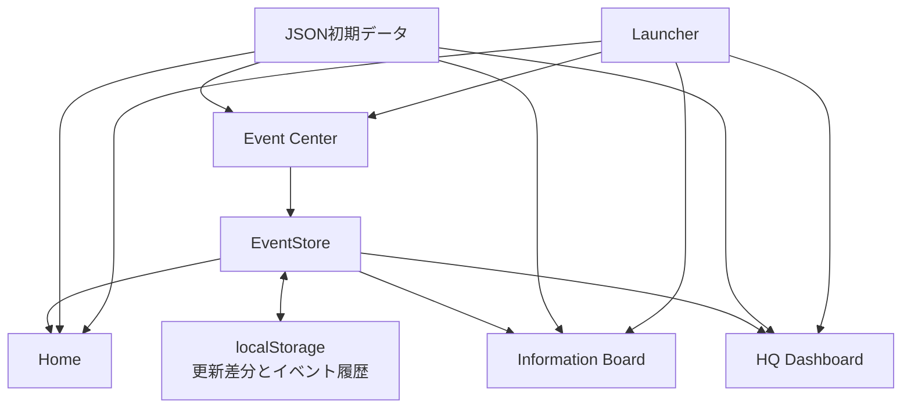

# 避難所業務支援Webアプリ V1.0 現行仕様

最終確認日：2026年8月14日

この文書は、現在のコードとデータから確認できるV1.0の実装仕様をまとめたものです。設計理由は [DESIGN_DECISIONS.md](DESIGN_DECISIONS.md)、開発経緯は [DEVELOPMENT_HISTORY.md](DEVELOPMENT_HISTORY.md)、既知の制約は [KNOWN_LIMITATIONS.md](KNOWN_LIMITATIONS.md) を参照してください。

## 1. システムの位置付け

本アプリは、災害時の避難所で発生した出来事を少ない操作で記録し、現場、本部、避難者向け表示へ必要な範囲だけ反映するブラウザ用プロトタイプです。

- 国・自治体の災害管理システムを代替しない
- 紙様式と併用する補助UIとする
- 医療、配食、詳細物流などの専門システムとは競合しない
- 個人情報を扱わず、避難所単位の集計値と状態を扱う
- V1.0は単一ブラウザ内で一日の業務フローを再現する

## 2. 技術構成

| 項目 | 現行仕様 |
|---|---|
| フロントエンド | HTML5、CSS3、JavaScript（ES6以降） |
| 地図 | Leaflet 1.9.4、OpenStreetMapタイル |
| 初期データ | JSONファイル |
| 更新差分 | ブラウザのlocalStorage |
| サーバーサイド | なし |
| データベース | なし |
| 対象言語 | 日本語 |
| 起動方式 | ローカルHTTPサーバーから配信 |

JSONを `fetch()` で読み込むため、HTMLファイルの直接起動ではなくHTTP配信が必要です。

```text
python -m http.server 8000
```

起動後、`http://localhost:8000/launcher.html` を開きます。

## 3. 全体構成



Event Centerから登録した更新はEventStoreを経由してlocalStorageへ保存されます。Home、Information Board、HQ Dashboardは、JSONの初期値へlocalStorageの更新差分を重ねて表示します。

## 4. 対象施設

初期データは次の5避難所です。

| ID | 施設名 | 初期状態 | 初期信頼度 |
|---|---|---|---|
| `shelter-001` | I市防災センター | 正常 | 確定 |
| `shelter-002` | I市立Alpha中学校 | 注意 | 推定 |
| `shelter-003` | I市立Beta小学校 | 要支援 | 確定 |
| `shelter-004` | I市立Gamma小学校 | 正常 | 確定 |
| `shelter-005` | I市立Delta中学校 | 未更新 | 未確認 |

Home、Event Center、Information Boardで操作・表示の中心となる施設は、`shelter-002`（I市立Alpha中学校）に固定されています。施設検索、利用者による施設切替、GPSによる選択はありません。

## 5. Launcher

ファイル：`launcher.html`

### 表示項目

- 避難所業務支援
- Information Board
- HQ Dashboard
- イベント入力

### 操作

各項目を押すと、`window.open()` により名前付きの別ウィンドウで対応画面を開きます。

| 項目 | 起動先 |
|---|---|
| 避難所業務支援 | `index.html` |
| Information Board | `information.html` |
| HQ Dashboard | `hq-dashboard.html` |
| イベント入力 | `event-center.html` |

## 6. Home

ファイル：`index.html`

### 6.1 ヘッダー

- 施設名：I市立Alpha中学校
- 現在時刻：1秒ごとに更新
- 今日の日付
- 「送信」ボタン

「送信」ボタンは実送信を行いません。未実装機能であることを画面内メッセージで示します。

### 6.2 画面切替

- ホーム
- 避難所地図

同一HTML内でタブ切替します。地図タブ表示時にLeafletの表示サイズを再計算します。

### 6.3 避難所ステータス

- 現在避難者数
- 最終更新者
- 最終正式確認時刻
- 水
- 食料
- 衛生
- 医療
- 最新物資受領
- 最新の避難所不具合

水・食料・衛生・医療を押すと、供給率、現在庫、更新時刻、信頼度をモーダル表示します。この4項目の詳細値はV1.0の固定ダミーデータです。物資受領と不具合の最新概要はEventStoreの保存内容を表示します。

### 6.4 出来事メニュー

- 人が来た
- 物が来た
- 困りごとが出た
- 状態が変わった

Home上の出来事ボタンは入力画面を開きません。現行実装では未実装案内を表示するだけです。実際のイベント入力はEvent Centerで行います。

### 6.5 お知らせと紙様式

- 今日のお知らせ
- 詳細を見る
- 紙様式を見る

これらのボタンも現行実装では画面遷移や印刷を行わず、未実装案内を表示します。

## 7. Home内の避難所地図

### 表示仕様

- 中心座標：緯度35.832、経度140.145
- 初期ズーム：12
- 表示地点：5避難所
- 状態色：緑、黄、赤、灰
- マーカー：色付きの「避」アイコン

### ポップアップ表示

- 施設名
- 避難者数
- 主要物資（水、食料、毛布）
- 更新時刻
- 信頼度

避難者数と状態にはlocalStorageの更新差分を反映します。主要物資の供給率表示は `supplies.json` の初期データを使用します。

緯度、経度、避難者総数などの必須値がない避難所はマーカー対象から除外します。Leafletを読み込めない場合はエラーメッセージを表示します。

## 8. Information Board

ファイル：`information.html`

### 用途

大型テレビ、プロジェクター、電子掲示板を想定した避難者向け表示専用画面です。入力ボタンや編集機能はありません。

### 表示項目

- 施設名
- 現在時刻
- 今日の日付
- 重要なお知らせ
- 本日のお知らせ
- 情報更新時刻
- 読込状態

施設名、重要なお知らせ、初期更新時刻は `notices.json` から取得します。`notices.json` 内の食事、給水、医療、入浴の固定スケジュールは、現行画面では表示しません。

Event Centerで登録したお知らせのうち、`公開` を選択したものだけを「本日のお知らせ」へ表示します。非公開のお知らせと避難所不具合は表示しません。

### 自動更新

- 時計：1秒ごと
- `notices.json` と公開情報：60秒ごと
- 同一ブラウザ内のEventStore更新時：即時再読込

データ更新に失敗した場合は、前回の画面表示を継続し、更新失敗メッセージを表示します。

## 9. HQ Dashboard

ファイル：`hq-dashboard.html`

### 9.1 上部集計

- 総避難所
- 正常
- 注意
- 要支援
- 未更新
- 更新遅延
- 現在時刻と日付

状態は次の対応です。

| データ値 | 表示 |
|---|---|
| `green` | 正常 |
| `yellow` | 注意 |
| `red` | 要支援 |
| `gray` | 未更新 |

更新遅延は、情報鮮度が30分を超えた避難所の件数です。

### 9.2 避難所一覧

| 表示列 | 内容 |
|---|---|
| 施設名 | 避難所名称 |
| 状態 | 正常、注意、要支援、未更新 |
| 現在避難者数 | 最新の現在人数 |
| 最終正式確認 | 現在の確認枠で確認済みなら時刻、未確認なら「○時確認 未実施」 |
| 情報鮮度 | 正式確認からの経過時間 |
| 信頼度 | 確定、推定、未確認 |

行はクリック、Enterキー、Spaceキーで選択できます。

### 9.3 ソート

次の項目を昇順・降順で切り替えます。

- 施設名
- 状態
- 現在避難者数
- 最終正式確認
- 情報鮮度
- 信頼度

初期値は情報鮮度の降順です。実装上は経過分数が大きい情報、つまり古い情報から並びます。

### 9.4 フィルター

単一条件を選択します。複数条件の同時指定はできません。

- すべて
- 正常のみ
- 注意以上（注意または要支援）
- 要支援のみ
- 未更新のみ
- 更新遅延のみ（30分超）

### 9.5 情報鮮度

避難者数の情報鮮度は、最終正式確認時刻を基準に計算します。

| 経過時間 | 表示区分 |
|---|---|
| 30分以内 | 緑 |
| 30分超、2時間以内 | 黄 |
| 2時間超、6時間以内 | オレンジ |
| 6時間超または正式確認なし | 黒 |

画面には「5分前」「2時間前」「1日前」のような経過時間も表示します。凡例上の「24時間超」は色名として残っていますが、現行判定では6時間を超えた時点で黒になります。

### 9.6 地図と詳細

地図には5避難所を状態色付きで表示します。一覧または地図から施設を選ぶと、次を表示します。

- 現在人数
- 正式確認人数
- 最終正式確認時刻
- 定時確認状況
- 主要物資
- 最終更新時刻
- 信頼度
- 最終更新者
- 最新受領情報
- 避難所不具合
- 連絡推奨理由
- 直近3件の更新履歴

連絡推奨理由は、注意・至急対応の不具合を優先します。不具合理由がない場合は初期履歴データの理由を使用し、現在の確認枠が未実施なら確認未実施を理由として扱います。

## 10. Event Center

ファイル：`event-center.html`

対象施設はI市立Alpha中学校に固定されています。

### 10.1 イベント一覧と詳細

`events.json` を読み込み、イベント名、説明、更新対象、影響画面、対象画面、優先度、最終更新者方針を表示します。

| イベント | 現行状態 |
|---|---|
| 避難者来所 | 入力・保存を実装済み |
| 物資受領 | 入力・保存を実装済み |
| お知らせ更新 | 入力・保存を実装済み |
| 避難所不具合 | 入力・保存を実装済み |
| 緊急連絡 | 定義と説明のみ。送信処理なし |
| 避難者数定時確認 | 入力・保存を実装済み |

### 10.2 避難者来所

入力方法：

- ＋1、＋5、＋10
- －1、－5、－10
- 増減人数の直接入力

入力は0以外の整数に限定し、更新後人数が0未満になる操作を拒否します。保存時に現在人数、更新時刻、最終更新者、履歴、共通イベント記録を更新します。

### 10.3 避難者数定時確認

表示項目：

- 今回の確認枠
- 次回確認予定
- 現在人数
- 前回正式確認人数
- 前回確認時刻
- 更新後の正式確認値

入力方法：

- 変更なし
- ＋1、＋5、＋10
- －1、－5、－10
- 現在人数を直接訂正

直接訂正は0以上の整数だけを受け付けます。空欄、小数、負数、更新後人数が0未満になる増減を拒否します。

確認時刻は09:00、13:00、18:00です。

| 現在時刻 | 今回の確認枠 | 次回確認 |
|---|---|---|
| 00:00〜08:59 | 前日18:00 | 当日09:00 |
| 09:00〜12:59 | 当日09:00 | 当日13:00 |
| 13:00〜17:59 | 当日13:00 | 当日18:00 |
| 18:00〜23:59 | 当日18:00 | 翌日09:00 |

保存時に現在人数、正式確認人数、正式確認時刻、確認枠、最終更新者、履歴、共通イベント記録を更新します。「変更なし」でも正式確認時刻と最終更新者を更新します。

### 10.4 物資受領

| 項目 | 仕様 |
|---|---|
| 物資種別 | 飲料水、食料、毛布、衛生用品、簡易トイレ |
| 数量 | 1以上の整数 |
| 単位 | ケース、箱、袋、個、枚、セット、台 |

荷姿換算、在庫加算、配送管理は行いません。受領した数量と単位をそのまま最新受領情報と履歴へ保存します。

### 10.5 避難所不具合

| 項目 | 選択肢 |
|---|---|
| カテゴリ | トイレ、ごみ・衛生、停電、断水、空調、建物、その他 |
| 状態 | 問題なし、注意、至急対応 |

カテゴリごとの最新状態を保存します。いずれかのカテゴリが「至急対応」なら避難所状態を要支援に、「注意」が最高なら注意に上書きします。「問題なし」だけの場合は状態上書きを解除します。

### 10.6 お知らせ更新

| 項目 | 入力規則 |
|---|---|
| タイトル | 必須、30文字以内 |
| 開始時刻 | 必須、24時間形式 |
| 場所 | 必須、40文字以内 |
| 短い本文 | 必須、100文字以内 |
| 公開状態 | 公開または非公開を必須選択 |

公開のお知らせだけがInformation Boardへ反映されます。非公開も履歴と内部イベントには保存されます。

### 10.7 通し試験用機能

- 任意のイベント発生日時を `datetime-local` で指定
- 空欄の場合は現在時刻を使用
- localStorage内の内部イベント件数を表示
- 確認操作後にテストデータを全消去

テストデータ初期化はlocalStorageキー全体を削除し、JSON初期値へ戻します。

## 11. EventStore

ファイル：`js/event-store.js`

### 責務

- 入力値の検証
- 更新日時の整形
- 最終更新者の付与
- localStorageへの保存
- 共通イベント履歴の追加
- JSON初期値と更新差分の統合
- 公開お知らせの抽出
- 定時確認枠と確認未実施の判定
- 同一ブラウザ内の画面更新通知

### 固定値

| 項目 | 値 |
|---|---|
| localStorageキー | `shelter-event-updates-v1` |
| 最終更新者 | `user_demo` |
| 画面表示履歴数 | 最新3件 |
| 正式確認時刻 | 09:00、13:00、18:00 |

### 更新通知

同一ウィンドウでは独自イベント `shelter-event-updated`、別ウィンドウではブラウザの `storage` イベントを使用します。HomeとHQ Dashboardは通知時にページを再読込し、Information Boardはお知らせを再読込します。

## 12. localStorage保存構造

保存状態は次の単位で管理します。

```json
{
  "shelters": {},
  "history": {},
  "confirmations": {},
  "events": [],
  "supplies": {},
  "issues": {},
  "notices": {}
}
```

| キー | 内容 |
|---|---|
| `shelters` | 避難所ごとの現在人数、更新時刻、最終更新者、状態上書き |
| `history` | 避難所ごとのイベント由来の更新履歴 |
| `confirmations` | 正式確認人数、確認時刻、確認枠、最終更新者 |
| `events` | 全イベントの共通記録 |
| `supplies` | 物資別の最新受領情報と全種別の最新値 |
| `issues` | カテゴリ別の最新不具合状態 |
| `notices` | 登録した公開・非公開のお知らせ |

共通イベント記録は次の項目を持ちます。

- `id`
- `eventType`
- `shelterId`
- `occurredAt`
- `updatedBy`
- `payload`
- `status`

画面上の更新履歴はJSON初期履歴とイベント履歴を合わせて最新3件に制限します。`events` 配列は通し試験で登録した全イベントを保持します。

## 13. JSONファイル

| ファイル | 役割 |
|---|---|
| `data/shelters.json` | 避難所の名称、位置、状態、初期更新時刻、信頼度、避難者内訳 |
| `data/supplies.json` | 水、食料、毛布、衛生用品、簡易トイレの供給率、残存時間、状態 |
| `data/history.json` | 初期の最終更新者、連絡推奨理由、直近履歴 |
| `data/notices.json` | Information Boardの施設名、重要情報、初期更新時刻、旧固定スケジュール |
| `data/events.json` | Event Centerのイベント定義 |

イベント操作はJSONファイル自体を書き換えません。

## 14. 日時・履歴・最終更新者

- 保存日時形式：`YYYY-MM-DD HH:mm`
- 履歴表示時刻：`HH:mm`
- 画面の時計：日本語ロケール、24時間表記
- 最終更新者：全イベントで固定の `user_demo`
- 「最終更新者」は責任者や固定の担当者を意味せず、そのレコードを最後に更新した主体を表す

## 15. エラー処理

- JSON取得がHTTPエラーの場合は初期化を中止し、画面に読込エラーを表示する
- 想定するJSON形式でない場合はエラーとして扱う
- localStorageのJSONが壊れている場合は空状態へ戻し、警告をコンソールへ出す
- 入力値が規則に合わない場合は保存せず、対象モーダル内に理由を表示する
- 避難者数が0未満になる更新は拒否する
- Information Boardの再読込失敗時は前回表示を維持する
- Leaflet未読込時は地図エラーを表示する

## 16. UI・アクセシビリティ方針

- PC、タブレット、スマートフォンでの表示を想定
- タッチしやすい大きさのボタンを使用
- 状態は色だけでなく文字と記号を併用
- モーダルに `role="dialog"` と `aria-modal="true"` を設定
- 状態通知に `role="status"`、エラーに `role="alert"` を使用
- 一覧行はキーボードでも選択可能
- Escapeキーと背景クリックで入力モーダルを閉じられる

正式なアクセシビリティ適合試験や全端末試験は実施していません。

## 17. V1.0で実装していないもの

- 緊急連絡の送信
- Home上の出来事ボタンからの入力
- 紙様式の表示・印刷
- ログイン、認証、権限管理
- 実ユーザーによる最終更新者記録
- サーバー、データベース、API、クラウド
- 複数端末同期、競合解決、バックアップ
- PWA、Service Worker、オフライン同期
- 個人名簿、来所者個別管理、一時外出管理
- 医療、配食、詳細物流、配送追跡
- OCR、AI、音声入力、画像認識
- GPS、QR、NFC、CSV取込、写真添付、チャット

## 18. 現行の運用上の制約

- 更新内容は同一オリジンの単一ブラウザ保存領域に限定される
- ブラウザデータを削除すると更新履歴も消える
- LeafletとOpenStreetMapタイルの取得にはネットワーク接続が必要
- 現場検証、行政運用、セキュリティ審査は未実施
- 5避難所の試験データであり、150施設での性能試験は未実施
- 情報鮮度、供給率、信頼度には試験用の値が含まれる
- ライセンスは未設定

詳細は [KNOWN_LIMITATIONS.md](KNOWN_LIMITATIONS.md) を参照してください。

## 19. 基準となる通し試験

[V1_TEST_SCENARIO.md](V1_TEST_SCENARIO.md) に、09:00から18:00までの9イベントを使った基準シナリオがあります。

最終期待状態は次のとおりです。

- 現在人数：96名
- 正式確認人数：96名
- 最終正式確認：18:00
- 最新受領：毛布20枚
- 避難所状態：至急対応を含む要支援
- Information Board：公開した14:00の給水情報のみ表示
- 画面履歴：最新3件
- EventStore内部履歴：9件

## 20. 関連文書

- [README.md](README.md)：目的、設計思想、完成範囲
- [DEVELOPMENT_HISTORY.md](DEVELOPMENT_HISTORY.md)：フェーズごとの開発経緯
- [DESIGN_DECISIONS.md](DESIGN_DECISIONS.md)：設計判断の理由
- [KNOWN_LIMITATIONS.md](KNOWN_LIMITATIONS.md)：既知の制約
- [PROJECT_TIMELINE.md](PROJECT_TIMELINE.md)：時系列
- [LESSONS_LEARNED.md](LESSONS_LEARNED.md)：開発を通じた振り返り
- [V1_TEST_SCENARIO.md](V1_TEST_SCENARIO.md)：V1.0通し試験手順

この文書に新規アイデアは含めません。将来案を検討する場合は、現行仕様と区別して `IDEAS.md` のバックログとして管理します。
