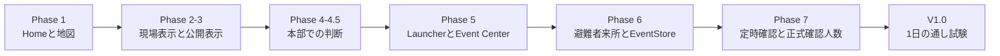

# プロジェクトタイムライン

この文書は、避難所業務支援Webアプリ V1.0の追加内容を時系列で追うための一覧です。各変更の背景は [DEVELOPMENT_HISTORY.md](DEVELOPMENT_HISTORY.md)、判断理由は [DESIGN_DECISIONS.md](DESIGN_DECISIONS.md) を参照してください。

## 日付について

現存するプロジェクト資料とバックアップ名から確認できる開発日は **2026年8月7日** です。各フェーズの個別日付を示す別記録はないため、推測で日付を割り当てず、同日の開発セッション内での実施順として整理しています。

## 時系列一覧

| 日付 | 段階 | 追加・変更したもの | 到達点 |
|---|---|---|---|
| 2026-08-07 | Phase 1 | Home、Leaflet地図、5避難所、ポップアップ、JSON分離 | 静的な初期プロトタイプが単独表示できた |
| 2026-08-07 | Phase 2 | 担当施設、避難所ステータス、状態詳細、簡潔なお知らせ | Homeで現在状況を先に確認できるようになった |
| 2026-08-07 | Phase 3 | Information Board、`notices.json`、自動再読込 | 避難者向け大型表示を現場画面から分離した |
| 2026-08-07 | Phase 4 | HQ Dashboard、統計、一覧、情報鮮度、地図、詳細 | 本部が複数避難所を一画面で確認できた |
| 2026-08-07 | Phase 4.5 | ソート、フィルター、最終更新者、履歴、連絡推奨理由 | 施設数が多い場合の確認優先度を付けやすくした |
| 2026-08-07 | Phase 5 | Launcher、Event Center、`events.json` | 画面の入口とイベント入力基盤を整えた |
| 2026-08-07 | Phase 6 | 避難者来所、EventStore、localStorage差分保存 | 人数更新がHomeとHQ Dashboardへ一連で反映した |
| 2026-08-07 | Phase 7 | 09・13・18時の定時確認、正式確認値、未実施表示 | 現在人数と最後に確認された人数を分けて扱えた |
| 2026-08-07 | V1.0完成前 | 物資受領、不具合、お知らせ、全イベント記録、試験時刻、初期化 | 朝から夕方までの通し試験に必要な最小イベントがそろった |
| 2026-08-07 | V1.0通し試験 | 1日9イベントの順次実行と画面間確認 | Event Center、Home、HQ Dashboard、Information Boardの流れを確認した |
| 2026-08-07 | 文書整理 | README再構成、開発履歴、設計判断、制約、タイムライン | 保守・公開検討・再開に必要な設計背景を文書化した |

## 機能の積み上がり

## V1.0通し試験の節目

通し試験では、09:00の正式確認から18:00の実数訂正までを順に実行しました。来所、物資受領、施設不具合、公開お知らせ、定時確認を混在させ、次を確認する構成です。

1. 現在人数と正式確認人数が異なる時間帯を表現できること
2. 物資と施設状態がHomeとHQ Dashboardへ反映されること
3. 非公開の内部情報と、Information Boardへ出す公開情報を分けられること
4. 画面上の履歴を3件に抑えながら、内部イベントを全件保持できること
5. 最終的に現在人数と正式確認人数が96人で一致すること

詳細な操作順と期待値は [V1_TEST_SCENARIO.md](V1_TEST_SCENARIO.md) にあります。

## 再開時の確認順

半年後に再開する場合は、次の順に読むと、実装と判断の境界を短時間で把握できます。

1. [README.md](README.md) で目的、構成、完成範囲を確認する
2. [DESIGN_DECISIONS.md](DESIGN_DECISIONS.md) で変えてはいけない設計意図を確認する
3. [KNOWN_LIMITATIONS.md](KNOWN_LIMITATIONS.md) で現状を本番機能と誤認しないようにする
4. [DEVELOPMENT_HISTORY.md](DEVELOPMENT_HISTORY.md) で変更の順序を追う
5. [V1_TEST_SCENARIO.md](V1_TEST_SCENARIO.md) でV1.0の基準動作を再確認する

---

[READMEへ戻る](README.md) / [開発履歴](DEVELOPMENT_HISTORY.md) / [設計判断](DESIGN_DECISIONS.md) / [既知の制約](KNOWN_LIMITATIONS.md)
