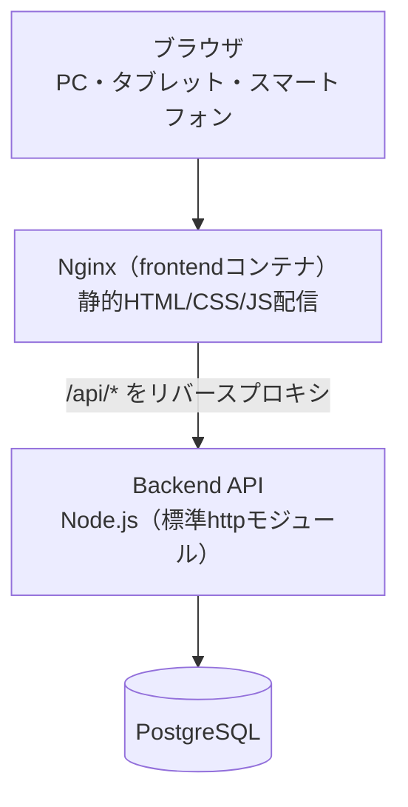

# 避難所業務支援Webアプリ V1実証版

> 本リポジトリに含まれる避難所名・地域名・位置情報・人数・物資・不具合・お知らせ・利用者名等は、システム動作確認のためにV1実証版で作成した架空・デモデータです。実在する自治体・施設・団体・個人とは関係ありません。

## 概要

避難所業務支援Webアプリは、災害時の避難所運営において、現場から必要最小限の操作で状況を記録し、本部側で複数避難所の状況をまとめて把握できるようにするための実証用Webシステムです。

V1実証版では、避難所の端末（Home / Event Center）から入力した内容が中央のPostgreSQLへ保存され、REST API経由で本部用画面（HQ Dashboard）と避難者向け表示（Information Board）へ共有されます。同一LAN内であれば、PC・タブレット・スマートフォンなど複数端末から同じ情報を参照できることを実機で確認済みです（後述）。

本システムは、行政が実運用に投入できる完成製品ではありません。5避難所規模・同一LAN内という限定された条件で、「現場入力 → 中央保存 → 本部/避難者への共有」という一連の流れが技術的に成立するかを確認するための実証版です。実運用に向けて不足している点は「[V1実証版の制限](#v1実証版の制限)」にまとめています。

なお、単一ブラウザ・サーバーなしで動作する初期プロトタイプ（V1.0）もこのリポジトリの開発初期に存在しましたが、現在のフロントエンドは全画面がAPI経由でデータを取得・保存する構成に置き換わっています。詳細は「[システム構成](#システム構成)」を参照してください。

## 背景・目的

災害時の避難所では、限られた人数が受付・物資・施設対応など複数の役割を同時に担うことが少なくありません。細かな様式への重複入力や画面ごとに異なる操作を求めると、記録そのものが現場の負担になります。

一方、本部側では「人数が正しいか」だけでなく、「いつ確認された情報か」「誰が最後に更新したか」が分からないと、どの避難所を優先的に確認すべきか判断しづらくなります。避難者向けの表示では、未確定の情報を出すと混乱を招くおそれもあります。

そこで本システムは、次の3点を中心に設計しています。

- **現場入力の負担を減らす**：業務分担ではなく「人が来た」「物が来た」のような出来事を起点にした、少ない操作での入力
- **情報を一箇所に集約する**：現場の入力を中央のデータベースへ保存し、画面ごとにばらばらの記録にしない
- **必要な範囲だけを共有する**：本部には現場の詳細（不具合・確認状況など）を、避難者向け画面には公開が明示された情報だけを表示する

設計判断の詳しい理由は [DESIGN_DECISIONS.md](DESIGN_DECISIONS.md) にまとめています。

## 主な機能

実装済みのAPI・画面・テストを確認して整理した内容です。

### 現場側（Home / Event Center）

- 避難所・利用者の選択（Launcher経由の簡易識別。認証ではありません）
- 避難者数の増減記録（＋1/＋5/＋10、－1/－5/－10、直接入力）
- 避難者数の定時確認（09:00・13:00・18:00の確認枠での「変更なし／増減／実数訂正」の記録）
- 物資受領の記録（種別・数量・単位）
- 避難所の不具合（トイレ・衛生・停電・断水・空調・建物・その他）の記録
- お知らせの登録（タイトル・開始時刻・場所・本文・公開／非公開の指定）
- 保存失敗時に「保存されていません」と明示し、成功扱いにしない通信エラー表示

### 本部側（HQ Dashboard）

- 全避難所の一覧表示（現在人数、状態、最終正式確認、情報鮮度、信頼度）
- 一覧のソート（施設名・状態・人数・確認時刻・情報鮮度・信頼度）と単一条件フィルター
- 地図表示（Leaflet、5避難所の位置と状態色）
- 避難所詳細（現在人数、正式確認人数・時刻、最新物資受領、不具合、最終更新者、直近3件の履歴）
- 情報鮮度（最終正式確認からの経過時間を緑・黄・オレンジ・黒で表示）と信頼度（確定／推定／未確認）の表示
- ポーリングによる自動更新。取得失敗時は前回表示を維持し、更新できなかったことを表示

### 避難者向け（Information Board）

- 選択中の避難所の「公開」指定されたお知らせだけを表示する、入力機能のない表示専用画面
- 非公開のお知らせや避難所の不具合情報は表示しない

## 画面構成

| 画面 | ファイル | 役割 |
|---|---|---|
| Launcher | `launcher.html` | 避難所・利用者の設定と、他4画面を開く入口 |
| Home | `index.html` | 選択中の避難所の現在状況を現場向けに表示・入力 |
| Event Center | `event-center.html` | 出来事を選んで詳細入力・通し試験を行う画面 |
| Information Board | `information.html` | 公開されたお知らせだけを避難者向けに表示 |
| HQ Dashboard | `hq-dashboard.html` | 複数避難所の状況を一覧・地図・詳細で確認 |

`docs/screenshots/` には旧UIの一部キャプチャが残っていますが、いずれも現在の画面構成やイベント内容と一致しないため、本READMEでは参照していません。実在地名が写っていたキャプチャは削除済みです。

## システム構成



- フロントエンドは全画面（Home / Event Center / HQ Dashboard / Information Board / Launcher）が共通の`js/api-client.js`経由でBackend APIを呼び出します。地図の座標（緯度経度）とイベント定義（`data/events.json`）のみ静的JSONを使用し、避難者数・状態・確認状況などの業務データはAPI/DBが唯一の情報源です。
- Backend APIとPostgreSQLはDocker Compose内部ネットワークのみで通信し、PostgreSQLのポートはホストやLANへ公開していません。
- 同一LAN内であれば、Frontendコンテナが公開するポート経由でPC・スマートフォンなど複数端末から同じAPI/DBへアクセスできます（同一LANのスマートフォンからHQ Dashboardへの反映を実機で確認済み）。

## 技術スタック

設定ファイルから確認できたものだけを記載しています。

| 分類 | 技術 |
|---|---|
| フロントエンド | HTML5 / CSS3 / JavaScript（ES6以降、フレームワーク不使用） |
| 地図表示 | Leaflet 1.9.4（CDN読み込み）、OpenStreetMapタイル |
| Webサーバー（静的配信 + APIプロキシ） | Nginx 1.28-alpine |
| バックエンドAPI | Node.js（Dockerイメージ: `node:24-alpine`。`package.json`の`engines`は`>=20`）、Node.js標準`http`モジュール（Webフレームワーク不使用） |
| DBクライアント | `pg` ^8.0.0 |
| データベース | PostgreSQL 17（`postgres:17-alpine`） |
| API仕様 | OpenAPI 3.0.3（`docs/openapi.yaml`） |
| コンテナ構成 | Docker Compose（`postgres` / `backend` / `frontend` の3サービス） |

## セットアップ

### 前提ソフトウェア

- Docker
- Docker Compose（Docker Desktop等でdocker composeコマンドが使える環境）

Windows / macOS / Linuxのいずれでも、上記が使える環境であれば同じ手順で動作します（OS固有の追加設定は確認していません）。

### 手順

```bash
git clone <このリポジトリのURL>
cd shelter-support-system
docker compose up --build -d
docker compose ps
```

`.env`ファイルは作成しなくても、`docker-compose.yml`のデフォルト値（`.env.example`と同じ値）で起動します。実値を変更したい場合は`.env.example`を`.env`としてコピーし、必要な値を書き換えてください。`.env`はGit管理対象外です。

## 起動

起動後、以下へアクセスできます。

- Frontend：`http://localhost:8080/launcher.html`
- API health：`http://localhost:3000/api/health`
- 避難所一覧API：`http://localhost:3000/api/shelters`

### DB初期化

```bash
docker compose exec backend npm run reset-db
```

migrationとseed（5避難所分のデモデータ投入）を個別に実行する場合は、`docker compose exec backend npm run migrate-db` / `npm run seed-db` を使用します。

### 停止・再起動

```bash
docker compose down       # コンテナを停止（DBのvolumeは保持）
docker compose up -d      # 再起動（DBデータは保持されたまま）
docker compose down -v    # DBのvolumeごと完全に削除する場合のみ
```

`backend`・`frontend`はDockerイメージのビルド時にソースコード（`backend/`・`js/`・`data/`など）をイメージへ取り込む構成です。コード変更後に反映するには`docker compose up --build -d`のように`--build`を付けて再ビルドする必要があります（単なる`docker compose up -d`では古いイメージのまま起動します）。

## デモデータ

冒頭の注意書きのとおり、本リポジトリに含まれる避難所名・座標・人数・物資・不具合・お知らせ・利用者名等は、V1実証版の動作確認のために作成した架空データです。実在する自治体・施設・団体・個人との関係を示すものではありません。

## テスト

以下は本README作成時点で実際に実行し、結果を確認したものです。ローカルにNode.jsが入っていなくても、Dockerだけで実行できます。

```bash
# Frontend（各画面のJavaScriptをNode.js上の疑似DOMで検証。PostgreSQL不要）
docker run --rm -v "$(pwd):/work" -w /work node:20-alpine node --test tests/
# → 81 pass / 0 fail

# Backend Unit（PostgreSQL不要）
docker compose exec backend npm test
# → 104 pass / 0 fail

# Backend Integration（docker compose upでPostgreSQLが起動している状態で実行）
docker compose exec backend npm run test:integration
# → 12 pass / 0 fail
```

Backend UnitとIntegrationは、ローカルにNode.jsがあれば`backend/`ディレクトリで直接`npm install && npm test`のように実行しても構いません。

Frontendテストは各画面のAPI呼び出し・入力検証・エラー表示を、Backend Unitテストは入力検証や信頼度・情報鮮度・確認枠判定などのドメインロジックとAPIの応答形式を、Backend Integrationテストは実PostgreSQLに対するトランザクション整合性（失敗時のロールバックを含む）・避難所間のデータ分離（他避難所へ影響しないこと）・9イベントの一日シナリオなどを検証します。

## API

APIの詳細仕様は [`docs/openapi.yaml`](docs/openapi.yaml)（OpenAPI 3.0.3）を参照してください。本READMEでは全項目を複製しません。

主なエンドポイントは次のとおりです。

- `GET /api/health`：稼働確認
- `GET /api/shelters`：避難所一覧
- `GET /api/shelters/{id}`：避難所詳細
- `GET /api/hq/shelters`：本部向け全避難所一覧
- `POST /api/shelters/{id}/events/visitor-change`：避難者数の増減
- `POST /api/shelters/{id}/confirmations`：定時確認
- `POST /api/shelters/{id}/supplies`：物資受領
- `POST /api/shelters/{id}/issues`：不具合登録
- `GET /api/shelters/{id}/notices` / `POST /api/shelters/{id}/notices`：お知らせ取得・登録（`?public=true`で公開分のみ取得）

エラーは`{ "error": { "code": ..., "message": ... } }`の共通形式で返り、入力不正は400、対象不存在は404、サーバー内部の予期しない障害は500、PostgreSQL等への接続不能時は503を返します。

## ディレクトリ構成

```text
├─ launcher.html / index.html / event-center.html / information.html / hq-dashboard.html
│    フロントエンドの各画面
├─ css/ , js/                共通CSSと画面別JavaScript
├─ data/                     地図座標・イベント定義など、業務データではない静的JSON
├─ backend/
│  ├─ src/                   APIサーバー本体（routes相当のapp.js、domain、repositories、services、db）
│  ├─ tests/                 Backend Unitテスト
│  └─ integration-tests/     PostgreSQLへ実際に接続するIntegrationテスト
├─ database/
│  ├─ migrations/            スキーマ定義
│  └─ seed/                  5避難所分のデモデータ投入用SQL
├─ docs/
│  ├─ openapi.yaml           API仕様（OpenAPI 3.0.3）
│  └─ screenshots/           旧UIのキャプチャ（現行画面とは不一致。上記「画面構成」参照）
├─ tests/                    Frontend側のテスト（Node.jsから各画面のJSを検証）
├─ frontend/ , backend/Dockerfile , docker-compose.yml   コンテナ構成
└─ .env.example              環境変数のサンプル
```

## V1実証版の制限

実装・設定ファイルを確認したうえでの、本番利用に関係する制限です。

- **実証用システムです。** 行政が正式運用できる完成製品ではありません。
- 本番運用を前提とした脆弱性診断・侵入テストなどのセキュリティ検証は実施していません。
- **認証・ログイン・権限管理は実装していません。** 入力時に選択する利用者IDは「誰が最後に更新したか」を示す識別子であり、本人確認や不正アクセス防止の機能はありません。
- 通信断・DB停止時はAPIが500/503を返し、画面側に「保存されていません」と明示する設計です。オフライン時の入力キューや自動再送機能はありません。
- 自動バックアップ・世代管理・障害復旧手順は整備していません。開発時に取得した手動DBダンプは本リポジトリには含めていません。
- 運用監視の基盤（ログ収集・アラート等）は整備していません。APIログは標準出力へのJSON1行ログのみです。
- 実際の災害現場や避難所運営訓練での検証は未実施です。同一LAN内でのスマートフォン実機・複数ブラウザによる共有確認は実施済みです（Android版Chromeで確認。Android版Firefoxでは日本語入力に関する既知の問題があり、詳細は [KNOWN_LIMITATIONS.md](KNOWN_LIMITATIONS.md) を参照してください）。
- 5避難所規模での確認であり、大規模施設数での性能・運用試験は未実施です。
- 施設名・座標・人数・お知らせ等はデモ用の架空データです（前述の「[デモデータ](#デモデータ)」参照）。

`CURRENT_SPECIFICATION.md`と`KNOWN_LIMITATIONS.md`は、サーバーやAPIを持たない初期プロトタイプ（V1.0）を基準に書かれた記述を多く含んでおり、本READMEが説明する現在のV1実証版（バックエンド・DBあり）とは一致しない箇所があります。現在のシステムについては本READMEと `V1_DETAILED_SPECIFICATION_v1.2.md` を優先してください。

## 今後について

`V1_DETAILED_SPECIFICATION_v1.2.md`に、V1実証版の結果を確認した後に初めて検討するとされている候補が挙げられています。以下はいずれも実装の約束ではなく、検討対象の一覧です。

- 認証・権限管理
- オフライン入力・同期・競合解決
- 本格的な監査ログ
- 本格的なバックアップ・障害復旧
- 大規模施設数（150施設規模）での負荷試験
- 本格的なセキュリティ対応
- 外部システムとの連携
- OSS公開の検討

## ライセンス

MIT Licenseで公開しています。詳細は [`LICENSE`](LICENSE) を参照してください。地図表示に使用しているLeaflet・OpenStreetMapのライセンス・帰属表示・利用条件は別途確認が必要です。

## 関連資料

- [開発履歴](DEVELOPMENT_HISTORY.md) / [設計判断](DESIGN_DECISIONS.md) / [既知の制約](KNOWN_LIMITATIONS.md) / [タイムライン](PROJECT_TIMELINE.md) / [V1.0通し試験](V1_TEST_SCENARIO.md)：いずれも初期プロトタイプ（V1.0）を中心に書かれた資料です。
- [`V1_DETAILED_SPECIFICATION_v1.2.md`](V1_DETAILED_SPECIFICATION_v1.2.md)：V1実証版の実装仕様（最上位の仕様書）
- [`V1_DEMONSTRATION_SPECIFICATION.md`](V1_DEMONSTRATION_SPECIFICATION.md)：V1実証版の範囲・完成条件
- [`AGENTS.md`](AGENTS.md)：このリポジトリでAIが作業する際の常駐ルール
