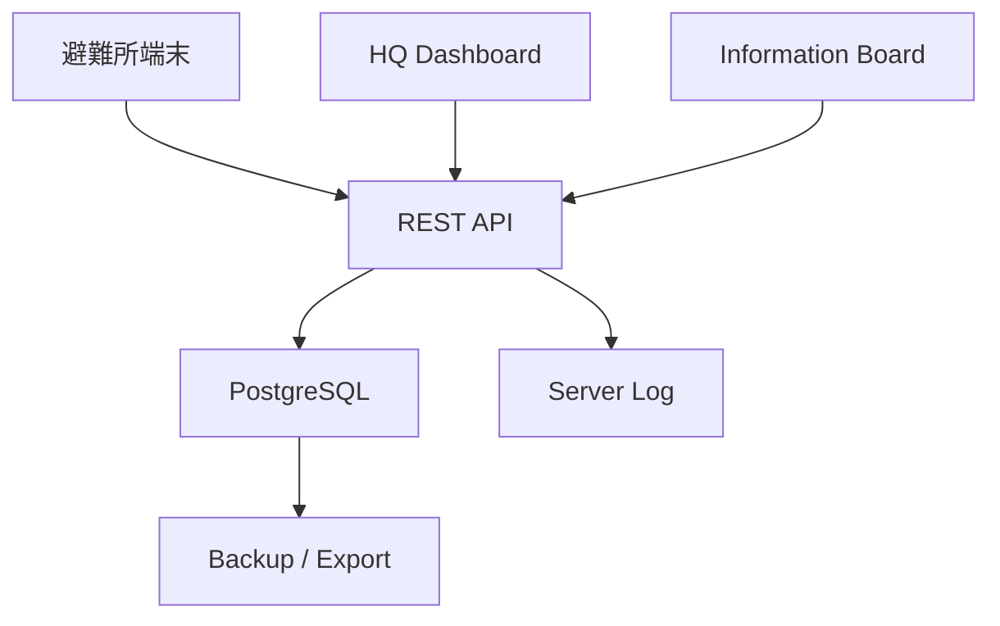

# 避難所業務支援Webアプリ V1実証版 仕様書

最終作成日：2026年8月14日  
基準文書：`CURRENT_SPECIFICATION.md`（V1.0現行仕様）

---

## 1. 文書の目的

本書は、現行V1.0プロトタイプを、複数端末・複数避難所で実証可能な「V1実証版」へ拡張するための仕様を定義する。

V1実証版の目的は、本番行政運用を完成させることではない。

実際の避難所業務を模した環境で、

- 避難所側から情報を入力できる
- 入力した情報を中央サーバーへ保存できる
- 複数端末間で情報を共有できる
- HQ Dashboardで複数避難所の状況を確認できる
- Information Boardへ公開情報を反映できる

ことを確認し、現場UI・情報共有方式・データ構造の妥当性を評価することを目的とする。

---

## 2. V1実証版の位置付け

### 2.1 現行V1.0

現行V1.0は、単一ブラウザ内で1日の避難所業務フローを再現するプロトタイプである。

主な構成：

```text
Browser
  ↓
JSON初期データ
  ↓
localStorage
```

### 2.2 V1実証版

V1実証版では、複数端末から共通データへアクセスできる構成へ変更する。

```text
避難所端末A ─┐
避難所端末B ─┤
避難所端末C ─┤
              ↓
            REST API
              ↓
          PostgreSQL
          ↑        ↑
    HQ Dashboard  Information Board
```

V1実証版では、5〜10避難所程度の模擬運用を想定する。

---

## 3. V1実証版の完成条件

V1実証版は、次の条件をすべて満たした時点で完成とする。

1. 5〜10避難所のデータを登録できる
2. 避難所ごとに入力対象を切り替えられる
3. 複数ブラウザまたは複数端末から同じサーバーへ接続できる
4. 避難者数を更新できる
5. 避難者数定時確認を登録できる
6. 物資受領を登録できる
7. 避難所不具合を登録できる
8. お知らせを登録できる
9. 公開お知らせがInformation Boardへ反映される
10. HQ Dashboardで全避難所の最新状態を確認できる
11. 更新内容がPostgreSQLへ保存される
12. 更新後に別端末から再読込して同じ内容を確認できる
13. 最低限の更新者情報を記録できる
14. 通信失敗時にユーザーへエラーを表示できる
15. DBデータのバックアップまたはエクスポートが可能である
16. 基準通し試験を複数端末構成で完了できる

---

## 4. 実証対象外

以下はV1実証版では実装しない。

- 本格的な認証基盤
- OAuth
- MFA
- 高度な権限管理
- オフライン入力
- Service Worker
- 自動再同期
- 同期競合解決
- 高度な二重送信対策
- 本格的な監査ログ
- 150避難所負荷試験
- 本番障害復旧設計
- 24時間365日運用
- Kubernetes
- 複数クラウド対応保証
- SMS通知
- メール通知
- 電話通知
- 個人名簿
- 来所者個別管理
- 一時外出管理
- 医療専門管理
- 配食管理
- 詳細物流
- 配送追跡
- AI
- OCR
- 音声入力
- 画像認識
- GPS
- QRコード
- NFC
- 写真添付
- チャット
- ドローン連携
- 外部行政システム連携
- オフライン地図

これらは、V1実証版完了後の「実運用試験版」以降で検討する。

---

## 5. 技術構成

| 項目 | V1実証版仕様 |
|---|---|
| フロントエンド | HTML5 / CSS3 / JavaScript（ES6以降） |
| 地図 | Leaflet 1.9.4 |
| 地図タイル | OpenStreetMap |
| API | REST API |
| API仕様 | OpenAPI形式で定義 |
| バックエンド | Node.js系を基本候補とする |
| データベース | PostgreSQL |
| 端末内保存 | 原則として一時UI状態のみ |
| サーバー配布 | Docker Compose対応 |
| 通信 | HTTP（開発） / HTTPS（外部実証時） |
| 対象言語 | 日本語 |
| 対象端末 | PC / タブレット / スマートフォン |

バックエンド実装技術は、詳細設計時に変更可能とする。ただしAPI仕様とDBデータ構造はフロントエンドから分離する。

---

## 6. システム構成



---

## 7. データ管理方針

### 7.1 localStorage依存の廃止

現行V1.0では更新差分をlocalStorageへ保存している。

V1実証版では、業務データの正式保存先をPostgreSQLへ変更する。

localStorageは、必要な場合でも以下に限定する。

- 選択中の避難所ID
- 利用者表示名
- UI設定
- 一時的な画面状態

業務履歴の正式保存先としては使用しない。

### 7.2 初期JSON

現行のJSONファイルは、以下の用途で残してよい。

- 初期データ投入
- デモデータ
- 開発用seedデータ

実証中の更新データはJSONファイルを書き換えず、DBへ保存する。

---

## 8. データベース仕様

最低限、次のテーブルを持つ。

### 8.1 shelters

避難所マスター。

主な項目：

- `id`
- `name`
- `latitude`
- `longitude`
- `initial_status`
- `is_active`

### 8.2 users

簡易利用者情報。

主な項目：

- `id`
- `display_name`
- `role`
- `is_active`

V1実証版では本格認証を行わないため、利用者識別用途を中心とする。

### 8.3 shelter_status

避難所の最新状態。

主な項目：

- `shelter_id`
- `current_count`
- `confirmed_count`
- `confirmed_at`
- `status`
- `confidence`
- `updated_at`
- `updated_by`

### 8.4 events

共通イベント履歴。

主な項目：

- `id`
- `event_type`
- `shelter_id`
- `occurred_at`
- `updated_at`
- `updated_by`
- `payload`
- `status`

### 8.5 confirmations

定時確認記録。

主な項目：

- `id`
- `shelter_id`
- `confirmation_slot`
- `confirmed_count`
- `confirmed_at`
- `updated_by`

### 8.6 supplies

物資受領記録。

主な項目：

- `id`
- `shelter_id`
- `supply_type`
- `quantity`
- `unit`
- `occurred_at`
- `updated_by`

### 8.7 issues

避難所不具合。

主な項目：

- `id`
- `shelter_id`
- `category`
- `severity`
- `occurred_at`
- `updated_by`

### 8.8 notices

お知らせ。

主な項目：

- `id`
- `shelter_id`
- `title`
- `start_time`
- `location`
- `body`
- `is_public`
- `created_at`
- `updated_by`

---

## 9. API仕様

V1実証版ではAPIを必要最小限にする。

### 9.1 避難所

```text
GET /api/shelters
GET /api/shelters/{id}
GET /api/shelters/{id}/status
```

### 9.2 イベント

```text
GET  /api/shelters/{id}/events
POST /api/shelters/{id}/events
```

### 9.3 定時確認

```text
POST /api/shelters/{id}/confirmations
```

### 9.4 物資

```text
POST /api/shelters/{id}/supplies
```

### 9.5 不具合

```text
POST /api/shelters/{id}/issues
```

### 9.6 お知らせ

```text
GET  /api/shelters/{id}/notices
POST /api/shelters/{id}/notices
```

### 9.7 HQ

```text
GET /api/hq/shelters
```

HQ用APIでは、一覧表示に必要な最新値をまとめて返す。

---

## 10. 避難所選択

現行V1.0では操作対象施設が `shelter-002` に固定されている。

V1実証版では固定を解除する。

### 起動時

初回アクセス時に避難所選択画面を表示する。

例：

```text
この端末で使用する避難所を選択してください。

○ I市防災センター
○ I市立Alpha中学校
○ I市立Beta小学校
○ I市立Gamma小学校
○ I市立Delta中学校
```

選択した避難所IDは端末内に保存してよい。

### 誤操作防止

通常の業務画面では常に現在の避難所名を表示する。

避難所変更は設定画面またはLauncherから行う。

---

## 11. 簡易利用者識別

V1実証版では本格ログインを実装しない。

起動時または設定時に、利用者名を設定できる。

例：

```text
利用者名：
[ 避難所担当01 ]
```

更新イベントには利用者IDまたは表示名を記録する。

目的は以下である。

- 誰が更新したか確認する
- 複数参加者による実証を可能にする
- `user_demo` 固定を廃止する

---

## 12. Launcher

現行Launcherの4画面構成を維持する。

- 避難所業務支援
- Information Board
- HQ Dashboard
- イベント入力

V1実証版では追加で、

- 避難所設定
- 利用者設定

への導線を用意してよい。

---

## 13. Home

### 13.1 基本表示

現行仕様を維持する。

- 施設名
- 現在時刻
- 今日の日付
- 現在避難者数
- 最終更新者
- 最終正式確認時刻
- 水
- 食料
- 衛生
- 医療
- 最新物資受領
- 最新不具合

表示データはAPIから取得する。

### 13.2 出来事メニュー

現行V1.0では未実装案内となっている以下のボタンを、実入力機能へ接続する。

- 人が来た
- 物が来た
- 困りごとが出た
- 状態が変わった

### 13.3 人が来た

現行の避難者来所入力UIを利用する。

入力：

- ＋1
- ＋5
- ＋10
- －1
- －5
- －10
- 直接入力

更新後人数が0未満になる操作は拒否する。

### 13.4 物が来た

現行の物資受領入力UIを利用する。

### 13.5 困りごとが出た

現行の避難所不具合入力UIを利用する。

### 13.6 状態が変わった

V1実証版では独立した自由状態編集を増やさず、既存の不具合状態または定時確認へ誘導する構成を優先する。

---

## 14. 定時確認

現行仕様を維持する。

確認時刻：

- 09:00
- 13:00
- 18:00

入力方法：

- 変更なし
- ＋1
- ＋5
- ＋10
- －1
- －5
- －10
- 現在人数を直接訂正

正式確認値は通常の来所イベントによる現在人数と区別して保持する。

---

## 15. 物資受領

現行仕様を維持する。

物資種別：

- 飲料水
- 食料
- 毛布
- 衛生用品
- 簡易トイレ

数量：

- 1以上の整数

単位：

- ケース
- 箱
- 袋
- 個
- 枚
- セット
- 台

V1実証版でも、在庫管理・配送管理・荷姿換算は行わない。

---

## 16. 避難所不具合

現行仕様を維持する。

カテゴリ：

- トイレ
- ごみ・衛生
- 停電
- 断水
- 空調
- 建物
- その他

状態：

- 問題なし
- 注意
- 至急対応

状態評価：

- 「至急対応」が1件以上 → 要支援
- 「注意」が最高 → 注意
- 全て問題なし → 不具合による状態上書きを解除

---

## 17. お知らせ更新

現行仕様を維持する。

入力項目：

- タイトル
- 開始時刻
- 場所
- 短い本文
- 公開 / 非公開

公開お知らせのみInformation Boardへ表示する。

---

## 18. Information Board

### 18.1 用途

避難者向け表示専用画面。

入力・編集機能は持たない。

### 18.2 表示

現行仕様を維持する。

- 施設名
- 現在時刻
- 今日の日付
- 重要なお知らせ
- 本日のお知らせ
- 情報更新時刻
- 読込状態

### 18.3 データ取得

localStorageではなくAPIから取得する。

### 18.4 更新

実証版では以下のどちらかとする。

- 30〜60秒間隔のポーリング
- 更新後に手動再読込

WebSocket等のリアルタイム通信は必須としない。

### 18.5 通信失敗時

API取得に失敗した場合、

- 前回取得した表示を維持
- 更新失敗を表示

とする。

---

## 19. HQ Dashboard

現行のHQ Dashboardを基本的に維持する。

### 19.1 上部集計

- 総避難所
- 正常
- 注意
- 要支援
- 未更新
- 更新遅延

### 19.2 一覧

- 施設名
- 状態
- 現在避難者数
- 最終正式確認
- 情報鮮度
- 信頼度

### 19.3 ソート

現行仕様を維持する。

### 19.4 フィルター

現行仕様を維持する。

### 19.5 詳細表示

現行仕様を維持する。

- 現在人数
- 正式確認人数
- 最終正式確認時刻
- 定時確認状況
- 主要物資
- 最終更新時刻
- 信頼度
- 最終更新者
- 最新受領情報
- 避難所不具合
- 連絡推奨理由
- 直近3件の更新履歴

### 19.6 データ取得

JSON＋localStorage方式からAPI方式へ変更する。

### 19.7 更新方式

V1実証版では、5〜30秒間隔のポーリングでよい。

WebSocketは必須としない。

---

## 20. Event Center

Event Centerは残す。

ただし、位置付けを以下へ変更する。

- 管理
- 検証
- 詳細入力
- 通し試験
- デバッグ

通常の避難所担当者はHomeから主要イベントを入力する。

---

## 21. 地図

現行Leaflet地図を維持する。

### 必須条件

地図取得に失敗しても、

- Home
- HQ一覧
- Event入力

を使用できること。

地図を業務必須機能にしない。

オフライン地図はV1実証版では実装しない。

---

## 22. エラー処理

最低限、以下を実装する。

### API通信失敗

```text
サーバーに接続できません。
入力内容は保存されていません。
通信状態を確認して、もう一度実行してください。
```

V1実証版ではオフラインキューを持たないため、保存できなかったことを明確に示す。

### DB保存失敗

保存失敗を成功扱いしない。

### 不正入力

現行仕様と同様に保存を拒否し、理由を画面内に表示する。

### API読込失敗

既存表示がある場合は可能な限り維持する。

---

## 23. 通信断の扱い

V1実証版では通信断中の入力保存を行わない。

通信断時は、

- 接続失敗を表示
- 入力は未保存であることを表示
- 再操作を促す

とする。

以下は実運用試験版へ延期する。

- IndexedDB未送信キュー
- 自動再送信
- オフライン同期
- 通信復旧時自動同期

---

## 24. 同時更新の扱い

V1実証版では、1避難所につき主入力端末1台を基本運用ルールとする。

同一避難所を複数端末から同時更新する高度な競合解決は実装しない。

ただし、複数端末から参照することは可能とする。

---

## 25. バックアップ

V1実証版では最低限、以下のいずれかを実装する。

### 必須

- PostgreSQLの定期ダンプ

または

- 管理画面からJSON/CSV等へエクスポート

少なくとも実証データを後から検証できる状態にする。

---

## 26. Docker Compose

V1実証版では、サーバー環境をDocker Composeで起動可能とすることを推奨する。

基本構成：

```text
frontend
backend
postgres
```

例：

```text
docker compose up
```

で実証環境を立ち上げられる状態を目標とする。

Kubernetesは使用しない。

---

## 27. UI・アクセシビリティ

現行方針を維持する。

- PC
- タブレット
- スマートフォン

を想定する。

継続する要件：

- タッチしやすいボタン
- 色だけに依存しない状態表示
- `role="dialog"`
- `aria-modal="true"`
- `role="status"`
- `role="alert"`
- キーボード操作
- Escapeキーによるモーダル終了

正式な適合認証取得はV1実証版の対象外とする。

---

## 28. 実証用避難所数

標準の実証データは5避難所とする。

必要に応じて10避難所程度まで増やして試験する。

150避難所規模の性能試験は行わない。

---

## 29. テスト環境

物理PCを複数台購入することは必須としない。

### 開発中

1台のPC上で複数ブラウザを利用してよい。

例：

```text
Chrome  → 避難所A
Edge    → 避難所B
Firefox → HQ Dashboard
別ウィンドウ → Information Board
```

### 最終確認

可能であれば以下を使用する。

```text
PC        → HQ Dashboard
スマートフォン / タブレット → 避難所入力
別ブラウザ → Information Board
```

実証参加者の端末を利用してもよい。

---

## 30. 基準通し試験

現行の `V1_TEST_SCENARIO.md` にある1日9イベントの基準シナリオを、API＋DB環境へ移植する。

最低限、以下を確認する。

### 初期確認

- 5避難所がHQに表示される
- 避難所端末から対象避難所を選択できる

### 操作

1. 避難者来所
2. 定時確認
3. 物資受領
4. 不具合登録
5. お知らせ登録
6. 公開お知らせ反映
7. HQ反映

### 複数端末確認

避難所端末で登録した内容が、

- HQ Dashboard
- Information Board

へ反映されることを確認する。

### 再起動確認

ブラウザを閉じ、再度開いてもDB上のデータが保持されていること。

---

## 31. V1実証版の試験シナリオ例

```text
避難所A端末
  ↓
09:00 定時確認 86名
  ↓
10:15 10名来所
  ↓
現在96名
  ↓
14:00 給水のお知らせを公開
  ↓
16:00 毛布20枚受領
  ↓
17:30 停電「至急対応」
```

期待結果：

### HQ Dashboard

```text
避難所A
現在人数：96
状態：要支援
最新受領：毛布20枚
最終更新：17:30
```

### Information Board

```text
14:00 給水のお知らせ
```

### DB

すべてのイベントが記録されている。

---

## 32. V1実証版と実運用試験版の境界

### V1実証版

```text
複数端末
+
API
+
DB
+
複数避難所
+
簡易利用者識別
+
Home入力
+
HQ共有
+
Information Board共有
```

### 実運用試験版

V1実証版完了後に以下を追加する。

```text
本格認証
権限管理
オフライン入力
未送信キュー
再同期
同期競合解決
二重送信防止
監査ログ
バックアップ強化
障害復旧
大規模負荷試験
セキュリティ試験
```

この境界は原則としてV1実証版完成まで変更しない。

---

## 33. 開発優先順位

### Phase 1：基盤

1. PostgreSQL導入
2. APIサーバー作成
3. 初期JSONのDB投入
4. APIから避難所一覧取得

### Phase 2：現行機能のAPI化

5. 避難者数
6. 定時確認
7. 物資受領
8. 不具合
9. お知らせ

### Phase 3：複数端末対応

10. 避難所選択
11. 簡易利用者識別
12. HQ API化
13. Information Board API化

### Phase 4：実証UI

14. Home出来事ボタン実装
15. 通信エラー表示
16. 最終更新者表示
17. 再読込動作確認

### Phase 5：実証試験

18. 複数ブラウザ通し試験
19. PC＋スマートフォン試験
20. DB保持確認
21. バックアップ確認
22. Docker Compose起動確認
23. V1実証版通し試験

---

## 34. スコープ凍結ルール

V1実証版完成までは、新規アイデアを本仕様へ直接追加しない。

新規案は `IDEAS.md` に記録する。

追加要求が出た場合は、以下を確認する。

1. V1実証に不可欠か
2. 既存機能では代替できないか
3. 実運用試験版へ延期できないか

3のいずれかで延期可能なら、V1実証版には追加しない。

---

## 35. V1実証版の最終ゴール

V1実証版のゴールは、

> 5〜10避難所程度を模擬し、複数端末から入力した避難所情報を中央DBへ保存し、HQ DashboardおよびInformation Boardへ共有できることを確認する。

ことである。

本版では、災害時の完全な本番運用を保証しない。

まず、

> 「現場から入力した情報が、本部と避難者向け画面へ正しく共有される」

というシステムの中核価値を実証することを最優先とする。

---

## 36. V1実証版完了後

V1実証版完了後は、次の順に進める。

1. 実証結果の記録
2. UI上の問題点整理
3. API・DB構造の見直し
4. `LESSONS_LEARNED.md` 更新
5. 実運用試験版へ進むか判断
6. OSS公開範囲・ライセンス検討

実証結果によって必要性が確認されるまで、高度な機能追加は行わない。
